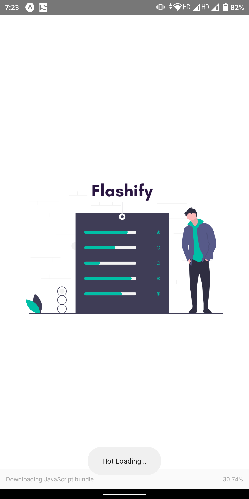
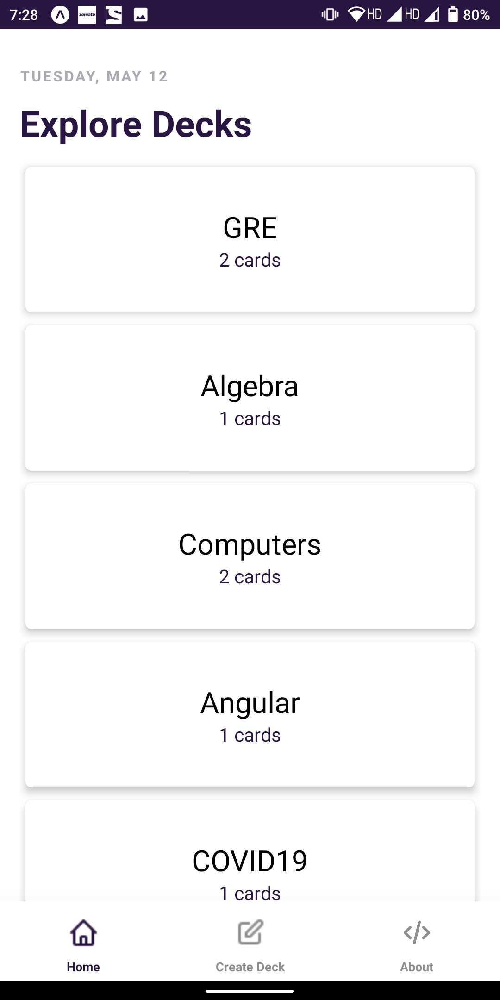
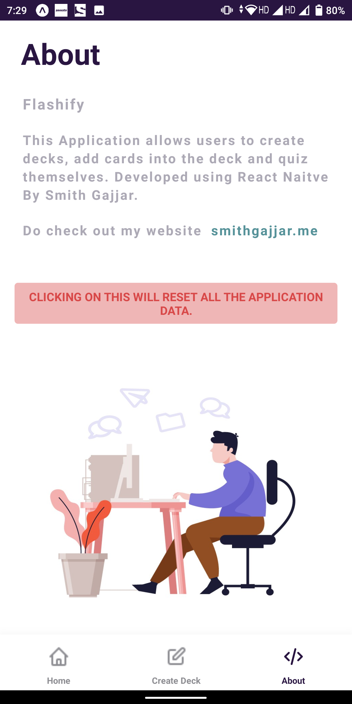
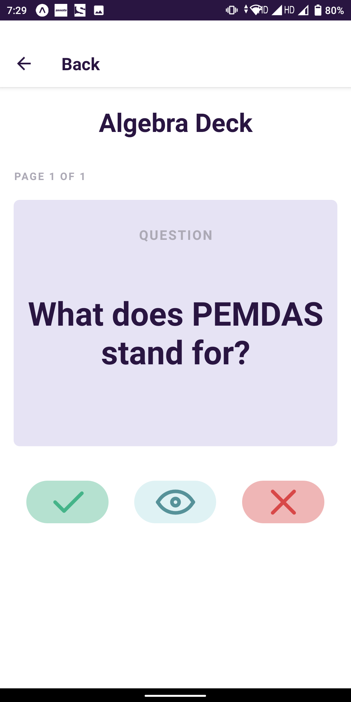

<!-- PROJECT LOGO -->
<br />
<p align="center">
  <a href="https://github.com/smithg09/Flashify_React_Udacity">
    
  </a>

  <h3 align="center">Flashify</h3>

  <p align="center">
    This Application allows users to create decks, add cards into the deck and quiz themselves.
    Developed using React Naitve.
    <br />
    <br />
<!--     <a href="https://expo.io/@smithg09/flashify">View Demo</a> -->
    </p>
</p>


<!-- TABLE OF CONTENTS -->
## Table of Contents

* [About the Project](#about-the-project)
* [Screenshots](#screenshots)
* [Built With](#built-with)
* [Getting Started](#getting-started)
  * [Installation](#installation)
  * [Usage](#usage)
* [Contact](#contact)


<!-- ABOUT THE PROJECT -->
## About The Project

This Application allows users to create decks, add cards into the deck and quiz themselves.Developed using React , React Naitve , Redux , Expo 
This app is the third of three projects required for [Udacity's React Nanodegree program](https://www.udacity.com/course/react-nanodegree--nd019).

    This Project is Tested on Android 9+ 

## Screenshots

<a href="#">
    
</a>

<a href="#">
    
</a>

<a href="#">
    
</a>

<a href="#">
    
</a>

### Built With

* [React](https://reactjs.org/)
* [React Native](https://reactnative.dev/)
* [Redux](https://redux.js.org/)
* [Expo](https://expo.io/)


<!-- GETTING STARTED -->
## Getting Started

To get a local copy up and running follow these simple steps.


### Installation
 
1. Clone the repo
```sh
git clone https://github.com/smithg09/Flashify_React_Udacity.git
```
2. Install NPM packages
```sh
npm install
```


<!-- USAGE EXAMPLES -->
### Usage

Now execute following command :  
```sh 
expo start OR npm start
```
This will open Expo Developer Tools in the browser.  You can then do one of the following.

- Use your device to test:

    Scan the QR Code using the Expo Client app ([Expo Client for Android](https://expo.io/tools#client))  from an Android.

- Use an Android Emulator to run the app:
    - [Android Emulator Setup](https://docs.expo.io/versions/v33.0.0/introduction/installation/#android-emulator)
